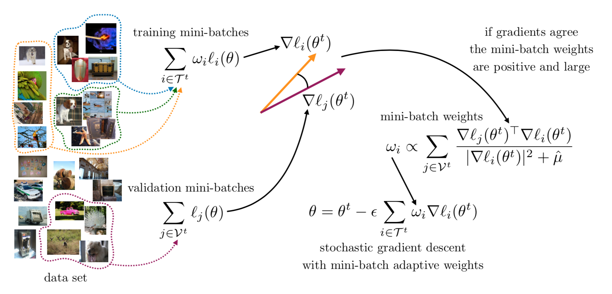
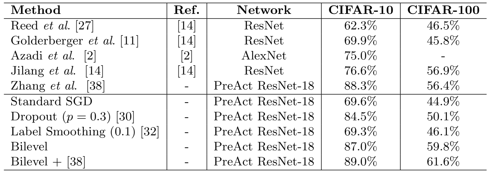

  <b style="font-size: 20px">Paper (coming soon):</b> 
  <a href="http://???" style="font-size: 20px; text-decoration: none">[Arxiv]</a>

*The training procedure of our bilevel formulation. At each iteration we sample mini-batches from the data set, which we split into a validation and a training set. The validation is used to define the weights of the loss gradient used in the stochastic gradient descent to update the model parameters. If the gradients of the training set and those of the validation set agree, then the weights are large and positive. Vice versa, if they disagree the weights might be zero or negative.*

# Abstract

We present a novel regularization approach to train neural networks that enjoys better generalization and test error than standard stochastic gradient descent. Our approach is based on the principles of cross-validation, where a validation set is used to limit the model overfitting. We formulate such principles as a bilevel optimization problem. This formulation allows us to define the optimization of a cost on the validation set subject to another optimization on the training set. The overfitting is controlled by introducing weights on each mini-batch in the training set and by choosing their values so that they minimize the error on the validation set. In practice, these weights define mini-batch learning rates in a gradient descent update equation that favor gradients with better generalization capabilities. Because of its simplicity, this approach can be integrated with other regularization methods and training schemes. We evaluate extensively our proposed algorithm on several neural network architectures and datasets, and find that it consistently improves the generalization of the model, especially when labels are noisy.

  <b style="font-size: 20px">Code:</b> 
  <a href="https://github.com/sjenni/DeepBilevel" style="font-size: 20px; text-decoration: none">[GitHub]</a>

# Results

*Comparison on CIFAR-10 and CIFAR-100 to state-of-the-art regularization techniques and methods for dealing with label noise on 40% corrupted labels.*
